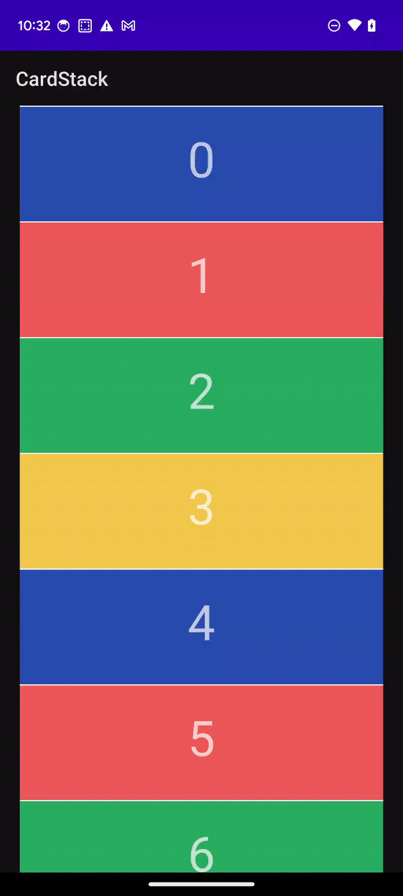
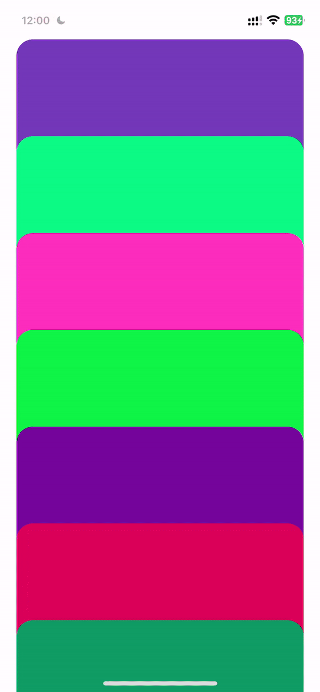

# Cardstack (Kotlin)
Create a CardStack UI similar to the iOS version in Kotlin

# AOS


# iOS


## Overview

Create a CardStack UI that just used simple component `Recyclerview`,`ItemDecoration`


### Item Collapse Area Setup
```
val isCollapsedItem = if (itemCount > 0) {
                getItem(0).collapsed
            } else {
                false
            }
            val collapsed = -300

            when (itemPosition) {
                0 -> {
                    if (isCollapsedItem) {
                        outRect.bottom = 600
                    } else {
                        outRect.bottom = 0
                    }
                    outRect.top = 0
                }

                else -> {
                    outRect.top = collapsed
                    outRect.bottom = 0
                }
            }
```

### Item Animation Setup

```
itemAnimator = DefaultItemAnimator().apply {
            moveDuration = 300
        }
```